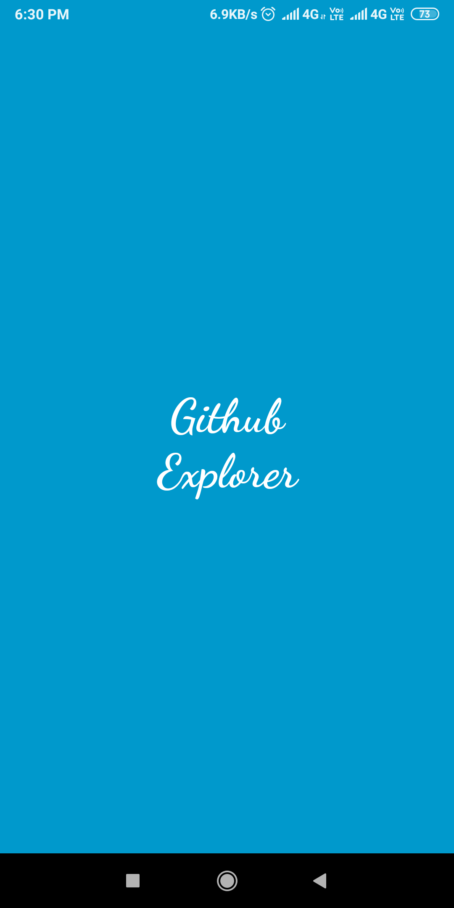
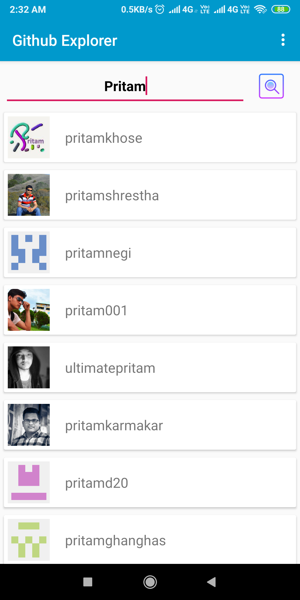
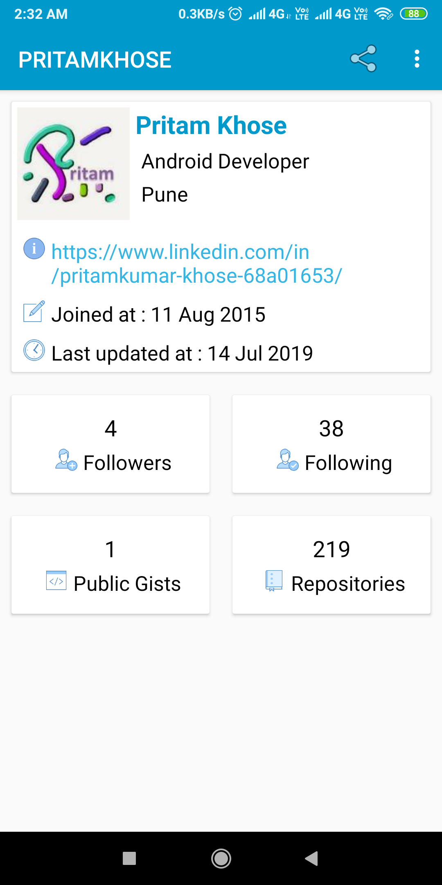
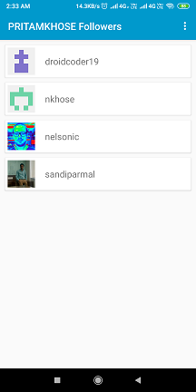
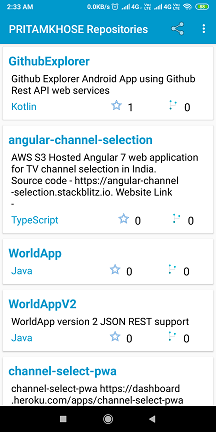

# GithubExplorer 
Github Explorer Android App using Github Rest API web services 

Introduction
------------

The goal of this application is to implement interface with Github REST API web service. 
It provide feature like search User's and it's details, along with list of user's Repositories, Followers and Following.

Getting Started
---------------
This project uses the Gradle build system. To build this project, use the
`gradlew build` command or use "Import Project" in Android Studio.

Github Documentation
---------
The official [Github Documentation REST API v3][10] in details.

Screenshots
-----------

Libraries Used
--------------
* Android
  * [AppCompat][11] - Degrade gracefully on older versions of Android.
  * [Android Kotlin][12] - Write more concise, idiomatic Kotlin code.
  * [Test][13] - An Android testing framework for unit and runtime UI tests.
* Third party
  * [Retrofit][21] to consume JSON data via HTTP REST client
  * [Picasso][22] for image loading
  * [Custom Tabs][23] for launching URLs in our android applications
  
[10]: https://developer.github.com/v3/
[11]: https://developer.android.com/jetpack/androidx
[12]: https://developer.android.com/kotlin
[13]: https://developer.android.com/training/testing/
[21]: https://square.github.io/retrofit/
[22]: https://square.github.io/picasso/
[23]: https://developer.chrome.com/multidevice/android/customtabs

Android Studio IDE setup
------------------------
For development, the latest version of Android Studio is required with Kotlin plugin configure. The latest version can be
downloaded from [here](https://developer.android.com/studio/).

- Start Android Studio and import or open project.

Upcoming features
-----------------
Updates will include many more android architectural pattern and updating existing components features.
